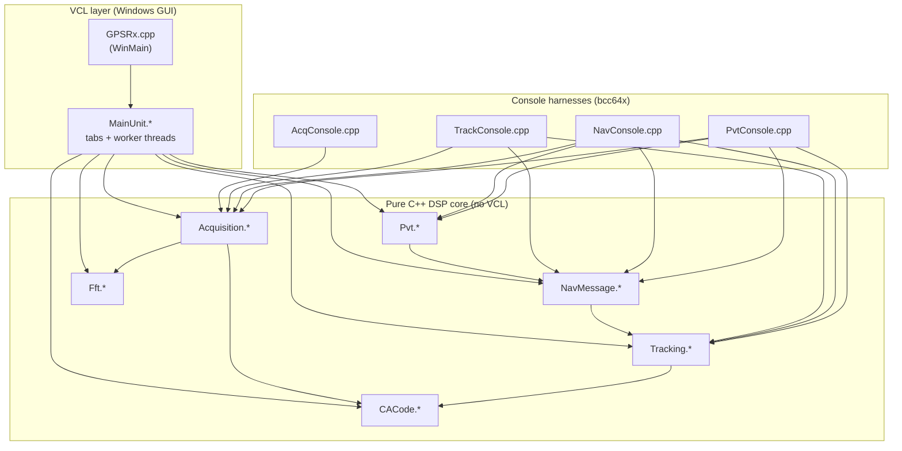
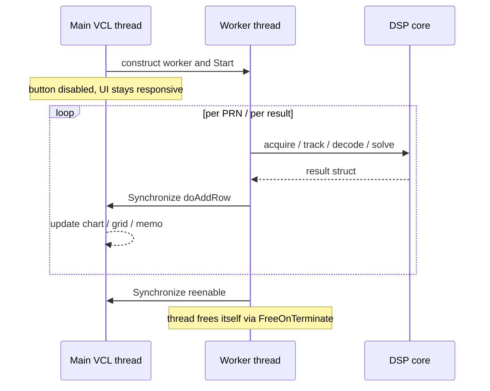

# GPSRx — Architecture & Algorithm Reference

This document explains **how the GPSRx code fits together** and **what every function does, algorithm
by algorithm**. It is the companion to [`README.md`](README.md): the README tells you what the program
is and how to build/run it; this document tells you how it works inside.

GPSRx is a from-scratch **software-defined GPS L1 C/A receiver**. It takes a file (or simulated stream)
of down-converted, digitized GPS intermediate-frequency (IF) samples — signed 8-bit integers — and runs
the complete receiver chain all the way to a latitude/longitude/altitude fix.

---

## Table of contents

1. [The receiver pipeline (big picture)](#1-the-receiver-pipeline-big-picture)
2. [Module map & dependencies](#2-module-map--dependencies)
3. [Key data structures](#3-key-data-structures)
4. [Algorithm reference, module by module](#4-algorithm-reference-module-by-module)
   - [4.1 `Fft.*` — transforms](#41-fft--transforms)
   - [4.2 `CACode.*` — Gold-code generator](#42-cacode--gold-code-generator)
   - [4.3 `Acquisition.*` — the sky search](#43-acquisition--the-sky-search)
   - [4.4 `Tracking.*` — carrier & code loops](#44-tracking--carrier--code-loops)
   - [4.5 `NavMessage.*` — bit sync, parity, ephemeris](#45-navmessage--bit-sync-parity-ephemeris)
   - [4.6 `Pvt.*` — orbits & position](#46-pvt--orbits--position)
   - [4.7 `MainUnit.*` — GUI & orchestration](#47-mainunit--gui--orchestration)
   - [4.8 Console harnesses](#48-console-harnesses)
5. [The threading model](#5-the-threading-model)
6. [End-to-end walkthrough of one position fix](#6-end-to-end-walkthrough-of-one-position-fix)
7. [Configuration & physical constants](#7-configuration--physical-constants)
8. [Glossary](#8-glossary)

---

## 1. The receiver pipeline (big picture)

A GPS satellite transmits a continuous signal that is, conceptually, three things multiplied together:

```
transmitted = (1023-chip C/A code, repeating every 1 ms)
            × (50 bit/s navigation data message)
            × (L1 carrier, 1575.42 MHz)
```

By the time the front end has band-limited, mixed, and digitized it, the carrier has been moved down to
a low **intermediate frequency** (here 9.55 MHz) plus an unknown **Doppler shift** (±5 kHz), and the code
and data are still riding on it. Recovering a position means undoing each layer in turn:

```
 IF samples (int8)
        │
        ▼
 ┌───────────────┐   Which satellites are visible, and at what code phase
 │  ACQUISITION  │   and Doppler?  (coarse 2-D search per PRN)
 └───────────────┘
        │  (PRN, codePhase, Doppler)  per found satellite
        ▼
 ┌───────────────┐   Continuously lock onto each satellite; follow its
 │   TRACKING    │   carrier (Costas PLL) and code (DLL); output one
 └───────────────┘   correlator "epoch" per millisecond.
        │  prompt-I / prompt-Q per ms
        ▼
 ┌───────────────┐   Find the 20 ms bit boundary, demodulate the 50 bps
 │  NAV DECODE   │   data, frame-sync on the TLM preamble, check parity,
 └───────────────┘   parse subframes 1/2/3 into ephemeris + clock terms.
        │  ephemeris + subframe timing  per satellite
        ▼
 ┌───────────────┐   Satellite ECEF positions (Kepler) + pseudoranges
 │      PVT      │   (from signal travel times) → least-squares solve →
 └───────────────┘   receiver ECEF + clock bias → WGS-84 lat/lon/alt.
        │
        ▼
   latitude / longitude / altitude
```

Each stage narrows uncertainty: acquisition finds *roughly* where each satellite's code and carrier are,
tracking refines and *holds* that alignment over time, nav-decode extracts the *meaning* (where the
satellite is and when it sent the signal), and PVT turns four-or-more such measurements into a *position*.

| Stage | File(s) | Input | Output | Core idea |
|-------|---------|-------|--------|-----------|
| Acquisition | `Acquisition.*`, `Fft.*`, `CACode.*` | first ~2 ms of samples | per-PRN (Doppler, code phase, confidence) | FFT correlation tests all code phases at once; sweep Doppler |
| Tracking | `Tracking.*`, `CACode.*` | samples aligned to a PRN's code phase | one I/Q correlator epoch per ms | two coupled feedback loops (Costas PLL + DLL) |
| Nav decode | `NavMessage.*` | per-ms prompt-I/Q | ephemeris + subframe timing | 20 ms bit sync → parity-checked LNAV frames |
| PVT | `Pvt.*` | ephemerides + pseudoranges | lat/lon/alt, clock bias, DOP | Kepler orbits + iterative least squares |
| GUI / orchestration | `MainUnit.*`, `GPSRx.cpp` | a capture file | live tabs + a fix | threads that run the chain off the UI thread |

---

## 2. Module map & dependencies

The project is split into a **pure-C++ DSP core** (no VCL, compiles identically in the console harnesses
and in the GUI app) and a **VCL layer** (the windowed application). The DSP core never includes a UI
header; the UI calls *into* the core.



**Dependency rules that hold throughout:**

- `Fft` and `CACode` are leaves — they depend on nothing but the standard library.
- `Acquisition` builds on `Fft` + `CACode`. `Tracking` builds on `CACode`.
- `NavMessage` depends on `Tracking` (it consumes `TrackEpoch`s). `Pvt` depends on `NavMessage` (it
  consumes an `Ephemeris`).
- Everything in the core lives in `namespace gps` (DSP) or `namespace dsp` (the FFT primitives).
- `MainUnit` is the only file that knows about both worlds: it includes the VCL **and** every core header,
  and it runs the core on background threads (Section 5).
- The four `*Console.cpp` programs link the **same** core `.cpp` files and act as per-stage acceptance
  tests against a real capture, independent of the GUI.

---

## 3. Key data structures

These plain structs are the "wires" between stages. Knowing them makes the function reference below much
easier to follow.

**Acquisition** (`Acquisition.h`)
- `AcqConfig` — search parameters: `fs`, `ifFreq`, Doppler range/step, `numMs` (records summed),
  `threshold` (peak-ratio to declare a lock).
- `AcqResult` — per-PRN outcome: `found`, `doppler` (Hz), `codePhaseSamp`/`codePhaseChips`, `peakRatio`.

**Tracking** (`Tracking.h`)
- `TrackConfig` — loop settings: `fs`, `ifFreq`, PLL/DLL noise bandwidths & damping, early–late spacing,
  `pdi` (predetection integration time = 1 ms).
- `TrackEpoch` — one millisecond of output: Early/Prompt/Late `I`/`Q`, current `doppler`, `codeFreq`,
  residual code phase, the two loop discriminators, the running `cn0`, and `sampleIndex` (the offset
  within the run buffer where this 1 ms began — used later to time pseudoranges).
- `TrackChannel` — one tracking channel (one satellite); holds all loop state between epochs.

**Nav decode** (`NavMessage.h`)
- `BitSync` — result of the 20 ms boundary search (`offset`, peak count, `valid`).
- `Ephemeris` — the decoded orbit + clock parameters (Keplerian elements, harmonic corrections,
  `af0/af1/af2`, `tgd`, `toe`, `toc`, IODE/IODC, week number, …).
- `SubframeRef` — one parity-passing subframe boundary: its `bitIndex`, `towCount` (HOW time-of-week),
  and subframe `id`.
- `NavDecode` — everything `decodeNav` produces: counts, resolved polarity, which subframes were seen,
  the list of `SubframeRef`s (for timing), and the `Ephemeris`.

**PVT** (`Pvt.h`)
- `SatState` — a satellite's ECEF position + SV clock correction at a transmit time.
- `PvtSolution` — the fix: receiver ECEF, clock bias, lat/lon/alt, GDOP, iterations, residual RMS.

**GUI carriers** (`MainUnit.h`) — `GuiTrackedChannel`, `GuiSatRow`, `GuiFix`, `PosSatProgress`: snapshots
copied out of worker threads and handed to the UI thread for display (see Section 5).

---

## 4. Algorithm reference, module by module

For each function: its signature, what it is for, and **the algorithm it runs**.

### 4.1 `Fft.*` — transforms

The whole acquisition search rests on fast circular correlation, which needs an FFT. The catch: one 1 ms
code period at `fs = 38.192 MHz` is **38192 samples**, and 38192 is *not* a power of two
(38192 = 16·7·11·31). So the module provides a classic power-of-two FFT **and** a Bluestein wrapper that
gives an *exact* DFT of any length by reducing it to power-of-two transforms.

#### `int Fft::nextPow2(int n)`
Returns the smallest power of two ≥ `n`. Algorithm: start at `p = 1`, left-shift (`p <<= 1`) until
`p >= n`. Used to size the Bluestein convolution buffer.

#### `void Fft::transform(std::vector<cd>& a, bool inverse)`
In-place iterative **radix-2 Cooley–Tukey FFT**; `a.size()` must be a power of two (it throws otherwise).
Two phases:

1. **Bit-reversal permutation.** Reorder the input so that the iterative butterflies can run in place.
   The loop maintains `j` as the bit-reversal of `i` by incrementing `j` "from the top bit down," swapping
   `a[i]` and `a[j]` when `i < j` (so each pair is swapped once).
2. **Danielson–Lanczos butterflies.** For each stage `len = 2, 4, 8, … , n`, the principal twiddle is
   `wlen = exp(±2πi/len)` (sign flips for inverse). For every length-`len` block and every `k` in the
   first half, combine the pair:
   ```
   u = a[i+k];  v = a[i+k+len/2] * w
   a[i+k]        = u + v
   a[i+k+len/2]  = u - v
   w *= wlen          // advance the twiddle incrementally
   ```
   For the inverse transform, every output is finally divided by `n` (so `IFFT(FFT(x)) == x`).

#### `BluesteinFft::BluesteinFft(int n)` — constructor
Precomputes everything that depends only on the length `n`, so repeated transforms of the same size are
cheap (acquisition does thousands at `n = 38192`). **Bluestein / chirp-z** rewrites the DFT as a
convolution:

- Choose `m = nextPow2(2n − 1)` — the linear-convolution length, rounded up to a power of two.
- Build the **chirp** `chirp_[k] = exp(−i·π·k²/n)`. To keep the angle accurate for large `k`, it reduces
  `k² mod 2n` *before* forming the angle (otherwise `k²` for `k ≈ 38000` overflows the precision of the
  cosine argument).
- Build the convolution **kernel** `v`: the conjugate chirp `conj(chirp_[k])`, zero-padded to length `m`,
  with its negative-lag half wrapped to the top of the buffer (`v[m−k] = conj(chirp_[k])`). It stores the
  *forward FFT* of that kernel, `vb_`, once.

#### `void BluesteinFft::run(const std::vector<cd>& in, std::vector<cd>& out, int sign) const` — private core
Evaluates the chirp transform that both `forward` and `inverse` are built on:

1. Pre-multiply the input by the chirp: `u[k] = in[k] · chirp_[k]` (zero-padded to `m`).
2. Forward-FFT `u`, multiply pointwise by the precomputed kernel spectrum `vb_`, inverse-FFT — i.e. a
   length-`m` circular convolution done in the frequency domain.
3. Post-multiply by the chirp again: `out[k] = u[k] · chirp_[k]`, for `k = 0…n−1`.

The result is the exact length-`n` forward DFT. (`sign` is vestigial — `run` always computes the forward
direction; `inverse()` handles the sign itself, see below.)

#### `void BluesteinFft::forward(in, out) const`
Thin wrapper: `run(in, out, −1)`. Computes `out[k] = Σ_n in[n]·exp(−2πi·nk/N)`.

#### `void BluesteinFft::inverse(in, out) const`
Computes the inverse DFT using the identity **IDFT(X) = conj( DFT( conj(X) ) ) / N**: conjugate the input,
run the same forward chirp transform, conjugate the result, and scale by `1/N`. This avoids needing a
separate inverse chirp.

> **Why it matters:** `forward`/`inverse` together let acquisition compute a 38192-point circular
> cross-correlation — which tests *all 38192 code phases simultaneously* — with a handful of
> power-of-two FFTs instead of an O(N²) correlation.

---

### 4.2 `CACode.*` — Gold-code generator

Every GPS satellite is identified by a unique 1023-chip **C/A Gold code** (its "PRN"). Acquisition and
tracking both need a local replica of that code.

#### `std::vector<int8_t> generateCACode(int prn)`
Generates the 1023-chip code for PRN 1…32 per IS-GPS-200. Algorithm — two 10-stage linear-feedback shift
registers (LFSRs):

- Two registers `G1[1..10]`, `G2[1..10]`, all stages initialized to 1.
- The per-PRN table `kG2Taps` selects **which two G2 stages are XORed** to form that satellite's G2
  output (this phase selection is what makes each PRN's code distinct).
- For each of the 1023 chips:
  1. `g1out = G1[10]`; `g2out = G2[tapA] XOR G2[tapB]`; the chip is `g1out XOR g2out` (logical 0/1).
  2. Map logical → **bipolar**: `0 → +1`, `1 → −1` (stored as `int8_t`), the form correlation wants.
  3. Clock both registers: feedback `G1 = 1 + x³ + x¹⁰` (XOR of stages 3 and 10) and
     `G2 = 1 + x² + x³ + x⁶ + x⁸ + x⁹ + x¹⁰`; shift every stage up one and load the new feedback into
     stage 1.

(The console self-test checks PRN 1's first 10 chips equal octal 1440, the IS-GPS-200 reference value.)

#### `std::vector<double> sampleCACode(const std::vector<int8_t>& code, double fs, int numSamples)`
Resamples the 1023-chip code to `numSamples` samples spanning exactly one code period at sample rate `fs`,
producing the `±1.0` replica used for FFT correlation. Algorithm — **nearest-/current-chip sampling**: for
sample `n`, the chip index is `floor(n·ts / tc)` where `ts = 1/fs` and `tc = 1/1.023 MHz`; a final
partial-period sample wraps with `% 1023`.

---

### 4.3 `Acquisition.*` — the sky search

Acquisition answers, for each PRN: *is this satellite present, and if so at what code phase and Doppler?*
It is a 2-D search — code phase (38192 possibilities) × Doppler (≈21 bins) — made tractable by doing the
entire code-phase axis in one FFT (**parallel code-phase search**).

The file is organized as several `namespace {}` helpers that build reusable intermediate results, plus the
public entry points. The big efficiency win: the carrier-wiped, FFT'd input ("baseband spectra") depends
only on the *data*, not the PRN, so it is computed **once** and reused for all 32 satellites.

#### `int samplesPerCode(double fs)` *(helper)*
`round(fs × 1e-3)` — number of samples in one 1 ms code period (38192 at the default `fs`).

#### `std::vector<std::vector<double>> makeBlocks(sig, len, n, numMs)` *(helper)*
Splits the int8 input into `numMs` real-valued 1 ms blocks of `n` samples each, **removing the DC bias**:
it computes the overall mean across all samples it will use and subtracts it from every sample. (A small
DC offset would otherwise show up as a false correlation artifact.) Throws if the buffer is too short.

#### `std::vector<std::vector<cd>> makeCarriers(cfg, n, nBins)` *(helper)*
Precomputes the complex carrier replica for each Doppler bin: `carrier_b[i] = exp(−j·2π·(IF + f_d)·i/fs)`,
where `f_d = dopplerMin + b·dopplerStep`. Multiplying the input by this **wipes off the carrier** (mixes
to baseband) for that Doppler hypothesis. Algorithm detail: rather than calling `sin`/`cos` `n` times per
bin, it generates the phasor **incrementally** — start at `1`, multiply by a fixed rotation
`exp(−jω)` each step.

#### `std::vector<std::vector<cd>> makeBasebandSpectra(blocks, carriers, plan, n, numMs, nBins)` *(helper)*
For every (Doppler bin, ms block) pair, forms the carrier-wiped baseband `bb[i] = carrier_b[i]·block_m[i]`
and forward-transforms it with the Bluestein plan. Returns the array of spectra `B`. This is the
PRN-independent work, computed once.

#### `AcqResult acquirePrnImpl(prn, basebandSpectra, plan, n, numMs, nBins, cfg)` *(helper — the heart)*
Correlates one PRN against the precomputed baseband spectra and decides if it is present:

1. **Local replica spectrum.** Generate the PRN code, sample it to `n` points, FFT it, and **conjugate**
   the result (`C = conj(FFT(code))`). Multiplying a baseband spectrum by `C` and inverse-transforming
   yields the circular cross-correlation of the data with the code — i.e. the correlation at *all* code
   phases at once.
2. **Search Doppler.** For each Doppler bin `b`, zero an accumulator `acc[0..n−1]` and, for each ms block,
   compute `prod = B · C`, inverse-FFT to `corr`, and **non-coherently accumulate** `acc[i] += |corr[i]|²`.
   Non-coherent summation (summing magnitudes, not complex values) adds sensitivity without needing to
   know the data-bit/carrier phase. Record the strongest code phase in this bin and keep the global best
   across all bins (`bestPeak`, `bestBin`, `bestPhase`, and the full `bestAcc` array).
3. **Confidence metric.** In the winning bin, find the **second-highest** peak that is at least ±1 chip
   away from the main peak (using *circular* distance so wrap-around is handled), excluding a guard band.
   The detection metric is `peakRatio = bestPeak / second`. A real satellite produces one sharp peak far
   above the noise floor; noise produces a flat field.
4. Fill `AcqResult`: Doppler = `dopplerMin + bestBin·dopplerStep`, code phase in samples and chips, and
   `found = (peakRatio ≥ cfg.threshold)`.

#### `AcqResult acquireOne(prn, signal, signalLen, cfg)` *(public)*
Convenience wrapper for a single PRN: builds the Bluestein plan, blocks, carriers, and baseband spectra,
then calls `acquirePrnImpl`.

#### `std::vector<AcqResult> acquireAll(signal, signalLen, cfg, progress)` *(public)*
Acquires PRN 1…32. Builds the shared intermediates **once**, then loops PRNs calling `acquirePrnImpl`,
invoking the optional `progress` callback as each completes (the GUI uses this to fill its bar chart in
real time). Returns all 32 results.

#### `double refineDoppler(sig, len, prn, coarseDoppler, cfg, rangeHz, stepHz, numMs)` *(public)*
The coarse search only locates Doppler to within ½ a 500 Hz bin, which can sit outside the carrier loop's
pull-in range. This does a **fine 1-D Doppler search in the time domain** so the Costas PLL can lock:

- The input `sig` must already start at the satellite's code phase, so the prompt code replica is fixed
  and aligned (no code-Doppler over the short window).
- Sweep trial frequency `f` from `coarseDoppler − rangeHz` to `+ rangeHz` in `stepHz` steps (defaults:
  ±300 Hz, 25 Hz). For each `f`, mix the signal with the code and the trial carrier
  `exp(−j·2π·(IF + f)·n/fs)` (incremental phasor again), integrate `I` and `Q` over each 1 ms block, and
  **non-coherently sum** `I² + Q²` across `numMs` blocks.
- Return the `f` that maximizes that power. Falls back to `coarseDoppler` if there isn't enough data.

---

### 4.4 `Tracking.*` — carrier & code loops

Once acquisition has a coarse fix, tracking *locks on and stays locked* as the geometry slowly changes.
Each `TrackChannel` runs **two coupled second-order feedback loops**, once per 1 ms:

- **Carrier loop — a Costas PLL.** Its `atan(Q/I)` discriminator is insensitive to the 180° flips of the
  navigation data bits, so it can track carrier phase/Doppler through the data modulation.
- **Code loop — a Delay-Locked Loop (DLL).** Early/Prompt/Late correlators with a normalized
  early-minus-late power discriminator keep the local code aligned to the incoming code.

When both are locked, the **Prompt-I** correlator output carries the 50 bps nav data (its sign over each
20 ms is one data bit).

#### `static void calcLoopCoef(double LBW, double zeta, double k, double& tau1, double& tau2)`
Converts a desired loop **noise bandwidth** `LBW` (Hz), **damping** `zeta`, and **loop gain** `k` into the
two time constants of a standard second-order loop filter:
```
Wn   = LBW · 8ζ / (4ζ² + 1)     // natural frequency from noise bandwidth
tau1 = k / Wn²
tau2 = 2ζ / Wn
```
Called once per loop in the constructor (PLL with `k = 0.25`, DLL with `k = 1.0`).

#### `TrackChannel::TrackChannel(int prn, double dopplerHz, const TrackConfig& cfg)`
Sets up one channel:
- Builds the local C/A replica as `±1` doubles (1023 chips).
- Seeds the **carrier** state from acquisition: `carrFreqBasis = IF + dopplerHz`, residual phase 0.
- Seeds the **code** NCO at the nominal chip rate (1.023 MHz), residual code phase 0.
- Computes both loop filters' coefficients via `calcLoopCoef`.
- Zeroes the C/N0 (narrowband/wideband power) accumulators.

#### `std::vector<TrackEpoch> TrackChannel::run(const std::int8_t* sig, std::size_t numSamples, int numMs, const std::atomic<bool>* abort)`
The main tracking loop. For each of `numMs` integration periods (it stops early if the stream runs out or
`abort` is set — used for responsive shutdown of long streaming runs):

1. **Block size.** The number of input samples in this code period depends on the current code frequency:
   `codePhaseStep = codeFreq / fs` (chips/sample), and `blksize = ceil((1023 − remCodePhase) / step)` —
   i.e. exactly enough samples to finish the current code period, carrying the fractional remainder into
   the next epoch.
2. **Correlate.** Walk the `blksize` samples, generating the **local carrier incrementally** (start at
   `(cos, sin)` of the residual phase; rotate by `exp(−j·2π·carrFreq/fs)` each sample — no per-sample
   trig). Demodulate to baseband (`ib = sin·raw`, `qb = cos·raw`, the SoftGNSS convention). For each
   sample compute the code phase `cp = remCodePhase + i·step`, index the replica at **Prompt** `floor(cp)`,
   **Early** `floor(cp − half)`, and **Late** `floor(cp + half)` (half the early–late spacing, with
   wrap-around via `% 1023`), and accumulate six correlator sums: `I/Q` × `{E, P, L}`.
3. **Advance phase state.** Roll `remCarrPhase` forward (mod 2π) and carry `remCodePhase` to the next
   epoch (`+= blksize·step − 1023`).
4. **Carrier loop update.** Costas discriminator `carrError = atan(Q_P / I_P) / 2π` (in cycles); push it
   through the second-order filter to get the NCO adjustment `carrNco`; set `carrFreq = carrFreqBasis +
   carrNco`.
5. **Code loop update.** Early/Late magnitudes `E = √(I_E²+Q_E²)`, `L = √(I_L²+Q_L²)`; **normalized
   discriminator** `codeError = (E − L)/(E + L)` (normalization makes it amplitude-independent); filter it;
   set `codeFreq = 1.023 MHz − codeNco` (if the code is arriving slightly fast, slow the NCO, and vice
   versa).
6. **C/N0 estimate (NWPR).** Accumulate narrowband and wideband power over a **20 ms** window (one nav
   bit): `NBP = (ΣI_P)² + (ΣQ_P)²`, `WBP = Σ(I_P² + Q_P²)`. Their ratio `μ = NBP/WBP` runs from 1 (no
   signal) toward 20 (clean lock); it is clamped to 19.8 (the estimator diverges as `μ → 20`), then
   converted to dB-Hz: `C/N0 = 10·log10( (μ−1)/(20−μ) / pdi )`.
7. **Emit a `TrackEpoch`** with all six correlators, the current Doppler (`carrFreq − IF`), code
   frequency, residual code phase, both discriminators, the running C/N0, and `sampleIndex` (the buffer
   offset where this 1 ms started — the timestamp PVT will need).

---

### 4.5 `NavMessage.*` — bit sync, parity, ephemeris

Tracking yields one prompt-I value per millisecond. This module turns that stream into the **navigation
message**: the satellite's orbit (ephemeris) and clock corrections, plus the precise timing needed for
pseudoranges.

#### `BitSync findBitSync(const std::vector<TrackEpoch>& ep)`
Finds where the 20 ms data-bit boundaries fall. A data bit lasts 20 C/A periods, so a bit *transition*
(a sign change in prompt-I) can only occur at a 20 ms boundary — and all genuine transitions land at the
same phase `n mod 20`, while noise transitions scatter evenly. Algorithm:

- Build a 20-bin **histogram** of `n mod 20` over every prompt-I sign change.
- The `offset` is the bin with the most transitions; record the runner-up too.
- Mark the sync `valid` only when the peak clearly dominates: `peak ≥ 5` **and** `peak ≥ 3 × second`.

#### `std::vector<int> demodulateBits(const std::vector<TrackEpoch>& ep, int offset)`
Demodulates to hard bits at 50 bps. Starting at `offset`, for each group of 20 prompt-I values it sums
them and outputs `1` if the sum ≥ 0 else `0`. (Summing 20 ms is matched-filtering the bit; it boosts SNR.)
The BPSK 180° polarity ambiguity is *not* resolved here — parity/preamble polarity handles it downstream.

#### `double estimateCN0(const std::vector<TrackEpoch>& ep, int bitOffset)`
A more robust C/N0 than the tracker's running estimate, because its 20 ms windows are **aligned to the
bit boundary** (so no window straddles a bit edge, which would corrupt the narrowband power). It averages
the NWPR ratio `μ` over all bit-aligned windows, clamps to 19.8, and converts once to dB-Hz with the same
`10·log10((μ−1)/(20−μ)/1e-3)` formula.

#### `static int xorOf(const int* d, std::initializer_list<int> idx)`
Helper: XOR together the data bits `d[k]` at the listed 1-based indices. Used to compute LNAV parity.

#### `static bool checkParity(const int* w, int D29s, int D30s, int* out24)`
Checks one 30-bit LNAV word against the **IS-GPS-200 Table 20-XIV** parity algorithm and recovers the data:

- The 24 source bits are recovered as `d_i = D_i XOR D30s` (the last parity bit of the *previous* word
  inverts the data when set — that is how GPS encodes the running parity).
- Recompute the six parity bits `p25…p30`, each as `D29s` or `D30s` XOR a specific fixed subset of the
  `d_i` (the six XOR masks are the table).
- If all six recomputed parity bits match the received parity bits `w[24..29]`, copy the 24 recovered data
  bits to `out24` and return `true`; otherwise `false`.

#### Bit-field extractors: `getU`, `getU2`, `sScale`, `uScale`
Helpers to pull fields out of a recovered 300-bit subframe (1-based, MSB first):
- `getU(sf, a, b)` — unsigned integer from bits `a…b`.
- `getU2(sf, a1,b1, a2,b2)` — a field split across two ranges (MSBs then LSBs), concatenated.
- `sScale(v, nbits, scale)` — interpret `v` as `nbits`-wide **two's complement**, multiply by `scale`.
- `uScale(v, scale)` — unsigned value × scale.

The `P2_*` constants are the IS-GPS-200 scale factors (`2⁻⁵, 2⁻¹⁹, 2⁻²⁹, …`). Angular fields stored in
*semicircles* are later multiplied by π to get radians.

#### `NavDecode decodeNav(const std::vector<int>& bits, int prn)`
Turns the demodulated bit stream into frames, checks parity, and parses the ephemeris:

1. **Frame sync.** Slide a window over the bits looking for the 8-bit **TLM preamble** `0x8B`
   (`10001011`), matching in *either* polarity (the BPSK ambiguity). `pol` records which.
2. **Parity over a full subframe.** At a candidate, parity-check all **10 words** (each needs the previous
   word's bits 29/30 as `D29s`/`D30s`; the first word borrows the two bits just before the preamble). If
   any word fails, count a `parityFail`, advance one bit, and keep searching. If all 10 pass, it is a
   real subframe boundary.
3. **Record the subframe.** Read the **subframe ID** and **TOW count** from the Hand-Over Word (HOW), push
   a `SubframeRef{bitIndex, towCount, id}` (used later to time pseudoranges), and stash the recovered
   300 bits for subframes 1/2/3 the first time each is seen. Advance 300 bits to the next subframe.
4. **Parse the ephemeris** once the subframes are captured, field by field per IS-GPS-200:
   - **Subframe 1 (SV clock):** week number, IODC, group delay `tgd`, clock reference time `toc`, and the
     polynomial coefficients `af0/af1/af2`.
   - **Subframe 2 (ephemeris part 1):** `iode`, `crs`, `Δn`, `M0`, `cuc`, eccentricity `e`, `cus`,
     `√A`, reference time `toe`.
   - **Subframe 3 (ephemeris part 2):** `cic`, `Ω0`, `cis`, `i0`, `crc`, `ω`, `Ω̇`, `idot`.
   Angular rates/angles are scaled and converted semicircles → radians. `eph.valid` is set when all of
   SF1+SF2+SF3 were decoded.

---

### 4.6 `Pvt.*` — orbits & position

The final stage converts ephemerides + pseudoranges into a position. Three pieces: satellite position
from orbital mechanics, the least-squares position solve, and the ECEF→geodetic conversion.

#### `static double wrapWeek(double t)`
Wraps a GPS time difference into ±½ week (±302400 s) by adding/subtracting a full week (604800 s), so that
`t − toe` and `t − toc` stay valid across the week rollover.

#### `SatState satPosition(const Ephemeris& e, double t)`
Computes a satellite's **ECEF position and clock correction** at GPS time `t` — the IS-GPS-200 user
algorithm (Table 20-IV):

1. Semi-major axis `A = (√A)²`; computed mean motion `n0 = √(μ/A³)`; corrected mean motion `n = n0 + Δn`;
   time from ephemeris `tk = wrapWeek(t − toe)`; mean anomaly `Mk = M0 + n·tk`.
2. **Kepler's equation** `Ek = Mk + e·sin(Ek)` solved by **fixed-point iteration** (12 passes — plenty,
   since GPS `e ≈ 0.01`).
3. True anomaly `vk = atan2(√(1−e²)·sin Ek, cos Ek − e)`; argument of latitude `Φk = vk + ω`.
4. **Second-harmonic corrections** to argument of latitude, radius, and inclination (the `cuc/cus`,
   `crc/crs`, `cic/cis` terms): `uk`, `rk`, `ik`.
5. In-plane coordinates `x′ = rk·cos uk`, `y′ = rk·sin uk`; corrected longitude of ascending node
   `Ωk = Ω0 + (Ω̇ − Ωe)·tk − Ωe·toe` (the `−Ωe` terms convert to the **earth-fixed** ECEF frame).
6. Rotate into ECEF `(x, y, z)`.
7. **SV clock correction** `dt = af0 + af1·(t−toc) + af2·(t−toc)² + dtr − tgd`, where the relativistic term
   `dtr = F·e·√A·sin Ek` (and `F = −4.442807633e-10`). Returns `Ek` too, as a diagnostic.

#### `static bool solve4(double A[4][4], double b[4], double x[4])`
Solves the 4×4 linear system `A·x = b` by **Gaussian elimination with partial pivoting** (pick the
largest pivot in each column for stability, eliminate that column from every other row, then back out
`x[i] = b[i]/A[i][i]`). Returns `false` if the matrix is singular. Used both for the LS update step and
for inverting the normal matrix to get GDOP.

#### `PvtSolution solvePvt(const std::vector<double>& pr, const std::vector<SatState>& sats)`
The **iterative least-squares** receiver position + clock-bias solve (needs ≥ 4 satellites). Starting from
the earth's center `(x,y,z,b) = 0`, it linearizes and iterates (up to 12 times):

1. For each satellite, compute a first-pass geometric range `ρ0` to the current estimate, then apply the
   **Sagnac / earth-rotation correction**: rotate the satellite's ECEF position by `Ωe·(ρ0/c)` — the
   angle the earth turns during signal travel — and recompute the range `ρ`.
2. Form the residual `res = (pr + c·dt_sv) − (ρ + b)` — measured pseudorange (plus SV clock advance)
   minus predicted (range plus receiver clock bias).
3. The measurement row is the unit line-of-sight vector plus a 1 for the clock term:
   `row = [−dx/ρ, −dy/ρ, −dz/ρ, 1]`. Accumulate the **normal equations** `AᵀA` and `Aᵀr`.
4. Solve `AᵀA · Δ = Aᵀr` with `solve4`, apply the correction `(x,y,z,b) += Δ`, track the post-fit
   residual RMS, and stop when `|Δ| < 1e-4`.
5. **GDOP** = `√trace((AᵀA)⁻¹)`, where the inverse is obtained by solving `AᵀA · colⱼ = eⱼ` for each unit
   vector. Finally convert ECEF → lat/lon/alt via `ecefToGeodetic`.

> The clever bit: the pseudoranges fed in are only *relative* (a common, unknown offset — the receiver
> clock error and the nominal travel time — is shared by all of them). The clock-bias unknown `b` absorbs
> that common offset, so a position still falls out. See Section 6.

#### `void ecefToGeodetic(double x, double y, double z, double& latDeg, double& lonDeg, double& altM)`
Converts ECEF metres to WGS-84 latitude/longitude/altitude. Longitude is direct: `lon = atan2(y, x)`.
Latitude/altitude have no closed form, so it **iterates** (8 passes of Bowring's method): from an initial
latitude estimate, compute the prime-vertical radius of curvature `N`, update altitude `alt = p/cos(lat) −
N` (with `p = √(x²+y²)`), then refine `lat = atan2(z, p·(1 − e²·N/(N+alt)))`. Eight iterations converge to
millimetres. Outputs degrees and metres.

---

### 4.7 `MainUnit.*` — GUI & orchestration

`MainUnit` is the VCL application: a tabbed window (**Acquisition / Tracking / Position**) plus a
"Stream from DAC" mode. Its job is to run the DSP core **off the UI thread** so the window stays
responsive, and to render results live. The heavy lifting is delegated to four `TThread` subclasses
(Section 5). Below, functions are grouped by role.

#### Configuration from the file name
- **`static bool extractMhz(const String& name, const String& tag, double& outHz)`** — scans the file name
  for a tag (`"fs"` or `"if"`) and parses the digits after it into Hz, treating `_` as the decimal point
  (`fs38_192` → 38.192 MHz → 38192000 Hz). Returns whether it found one.
- **`static gps::AcqConfig configForFile(const String& path)`** — builds an `AcqConfig` from the file
  name, overriding `fs`/`ifFreq` when the tags are present and otherwise keeping the defaults (so the
  bundled capture decodes out of the box).

#### Form lifecycle & settings
- **`TMainForm::TMainForm(TComponent* Owner)`** — constructor: initializes state, configures the open
  dialog and the acquisition bar chart (wires up the hover handler), loads settings, and builds two
  runtime-created UI elements that aren't in the `.dfm` — a **View ▸ Settings** menu item and a
  **"Stream from DAC"** button.
- **`~TMainForm()`** — destructor: cleanly stops the streaming worker before the GUI is torn down (so it
  can never `Synchronize` to a destroyed form) — clears its `OnTerminate`, sets the abort flag, `WaitFor`s
  it (which keeps pumping `Synchronize`, avoiding deadlock), then deletes it and any parked worker.
- **`loadSettings()` / `saveSettings()`** — read/write the DAC sample rate and IF to `GPSRx.ini` next to
  the executable (defaults match the bundled capture).
- **`settingsClick(TObject*)`** — builds a small modal dialog (in code, no `.dfm`) with two edit boxes for
  the DAC rate and IF, validates the input, and persists it.

#### Acquisition tab
- **`btnAcquireClick(TObject*)`** — the "Acquire" button: builds the config from the file name, disables
  the button, and launches a `TAcqThread`.
- **`beginAcquisition()`** — clears the cached results and the bar chart for a fresh sky search.
- **`addAcqResult(const gps::AcqResult&)`** — adds one PRN's bar to the chart as acquisition reaches it
  (green if found, grey if not) and caches the result for the hover tooltip.
- **`showAcqResults(const std::vector<gps::AcqResult>&)`** — fills the whole bar chart from a complete
  result set (used by the streaming worker, which acquires in one shot per pass).
- **`Chart1MouseMove(...)`** — finds the bar under the cursor and shows a tooltip with that PRN's Doppler,
  code phase, and peak ratio.
- **`File2Click(TObject*)`** — File ▸ Open: opens a capture, shows the name, resets the chart.

#### Tracking tab
- **`btnTrackClick(TObject*)`** — gathers the acquired satellites and launches a `TTrackThread` to track
  each for 1000 ms.
- **`buildTrackingCharts()`** — one-time construction of the four tracking charts (I/Q constellation,
  prompt-I time series, Doppler/C-N0 trends) with draggable splitters, anchored to resize with the window.
- **`plotChannel(int idx)`** — plots one tracked channel: the I/Q scatter (decimated to ~800 points,
  skipping loop settling), a 300 ms window of prompt-I (the visible nav-bit transitions), and the Doppler
  and C/N0 trends.
- **`addTrackedChannel(const GuiTrackedChannel&)`** — appends a row to the channel grid (PRN, Doppler,
  C/N0, LOCKED/--), logs a status line, and plots the first channel automatically.
- **`resetTracking()`** — clears the grid and cached channels and relabels the header (shared by manual
  tracking and streaming).
- **`sgChannelsSelectCell(...)`** — re-plots when the user selects a different channel row.

#### Position tab
- **`btnFixClick(TObject*)`** — the "Compute Fix" button: requires ≥ 4 acquired satellites, builds the
  Position layout, resets the table, and launches a `TPvtThread` (36 s integration).
- **`buildPositionSky()`** — one-time construction of the Position layout: the satellite table, the fix
  summary memo, and the custom sky plot, separated by draggable splitters.
- **`FchSkyAfterDraw(TObject*)`** — custom-draws the **sky plot**: a polar az/el grid (North up, outer ring
  = horizon, rings at 30°/60°) and one dot + PRN label per satellite above the horizon. It maps each
  satellite's `(azimuth, elevation)` to screen coordinates (`radius ∝ 90 − elevation`, angle = azimuth
  measured clockwise from North).
- **`addPosSat(const PosSatProgress&)`** — adds/refreshes one PRN's row in the satellite table live as a
  parallel worker finishes it (C/N0, Doppler, ephemeris state).
- **`applyFix(const GuiFix&)`** — fills the pseudorange column, writes the full fix summary to the memo
  (lat/lon/alt, ECEF, clock bias, GDOP, residual RMS, sanity check), and refreshes the sky plot.
- **`resetPositionTable()`** — clears and relabels the satellite table.

#### The shared PVT assembly (GUI-free, deterministic)
- **`static GuiFix solveFixFromChannels(const std::vector<PvtChan>& chans, double fs)`** — the heart of the
  Position stage, shared by the single-fix and streaming workers. It forms pseudoranges at a common
  subframe boundary and solves the fix:
  1. Group every parity-passing subframe by its TOW count; pick the TOW shared by the **most** channels
     (those subframes were all transmitted at the same GPS instant).
  2. For each such channel, find the millisecond epoch at that subframe's leading edge
     (`ms = bitOffset + bitIndex·20`), read its absolute sample index, and convert to a fractional
     millisecond arrival time `absSample / samplesPerCode`.
  3. Normalize the arrival times to the earliest one and add `START_OFFSET = 68.802 ms` (a nominal one-way
     travel time); multiply by `c` to get pseudoranges in metres. (Only the *relative* ranges matter; the
     common offset is absorbed by the receiver clock bias.)
  4. Compute each satellite's ECEF position with `satPosition` at `transmitTime = bestTow·6 − 6` seconds.
  5. Solve with `solvePvt`, fill the `GuiFix`, and compute **look angles** for the sky plot: rotate each
     ECEF line-of-sight into the local East/North/Up frame and take `az = atan2(E, N)`,
     `el = atan2(U, √(E²+N²))`.

#### Streaming control
- **`btnStreamClick(TObject*)`** — toggles the "Stream from DAC" mode: starts a `TStreamThread` (or
  requests it to stop if already running), jumps to the Position tab, and disables the manual buttons.
- **`streamStopped()` / `streamDone(TObject*)`** — re-enable the UI when streaming ends; `streamDone` is
  the worker's `OnTerminate` handler and also manages deferred deletion of the (non-self-freeing) thread.

---

### 4.8 Console harnesses

Four standalone command-line programs (built with `bcc64x`, not part of the VCL project) that exercise and
validate each stage against a real capture. They link the **same** core `.cpp` files the GUI uses, so a
pass here means the DSP is correct independent of the UI.

- **`AcqConsole.cpp`** — runs two self-tests first (`testCACode` checks PRN 1's first chips against the
  IS-GPS-200 reference; `testFft` checks Bluestein against a brute-force DFT and a 38192-point round trip),
  then acquires PRN 1…32 and prints a table sorted by peak ratio.
- **`TrackConsole.cpp`** — acquires the strongest satellite, tracks it, and prints a lock assessment
  (carrier Doppler stability, `mean|I_P|/mean|Q_P|`, C/N0, nav-bit sign edges). Then it re-runs every found
  satellite through `refineDoppler` + tracking + bit-aligned C/N0 and reports how many lock.
- **`NavConsole.cpp`** — acquires + tracks the strongest satellite for ~36 s, runs bit sync, demodulates,
  decodes the frame, and sanity-checks the ephemeris (eccentricity range, `√A ≈ 5153`, inclination, IODE
  == IODC LSBs) and the resulting satellite ECEF radius (~26560 km).
- **`PvtConsole.cpp`** — the full end-to-end fix: acquire, track + decode every satellite, align them on a
  common subframe TOW, form pseudoranges, solve PVT, and sanity-check that the receiver lands on/near the
  WGS-84 surface. This is the reference the GUI's Position tab mirrors.

(`read_nordnav_data.m` is a small MATLAB snippet showing how a different IF capture is read — front-end
parameters for the NordNav data set — included for reference only.)

---

## 5. The threading model

The DSP is slow (seconds per stage), so running it on the UI thread would freeze the window. Every heavy
operation runs on a background thread; the **golden rule** is that *only the main (VCL) thread touches the
GUI*. Workers stage their results in a member variable and call `Synchronize(method)`, which runs `method`
on the main thread.



The four workers:

| Worker | Trigger | What it does | Lifetime |
|--------|---------|--------------|----------|
| `TAcqThread` | Acquire button | reads first ~2 ms, runs `acquireAll` with a per-PRN callback that `Synchronize`s each bar | `FreeOnTerminate` (self-frees) |
| `TTrackThread` | Track button | tracks each found satellite for 1000 ms **sequentially**; pushes a channel row per satellite | `FreeOnTerminate` |
| `TPvtThread` | Compute Fix | reads ~36 s **once** into a shared buffer; tracks all satellites **in parallel** (a bounded `std::thread` pool over an atomic work index); decodes; `solveFixFromChannels`; applies the fix | `FreeOnTerminate` |
| `TStreamThread` | Stream from DAC | loops "passes": each pass re-acquires, parallel-tracks, decodes, solves, and updates all three tabs live; advances the read offset (~¼ window) and wraps at EOF; honors a stop flag | **owner-managed** (stop + `WaitFor` + delete) |

Two patterns worth calling out:

- **Shared read-only buffer + parallel pool (`TPvtThread`, `TStreamThread::runPass`).** Every channel
  tracks the *same* time window and differs only by its sub-millisecond code-phase offset, so the ~1.3 GB
  span is read **once** into one read-only buffer and each tracker indexes into it at its own offset. A
  bounded pool (≤ hardware threads) pulls PRNs off an `std::atomic<int>` work index; each result lands in
  its **own slot** (no locking on results); completion messages go through a small mutex-guarded queue
  that **only the VCL thread drains** and posts via `Synchronize`. The lock is never held across a
  `Synchronize` call.
- **Safe streaming shutdown.** `TStreamThread` is *not* `FreeOnTerminate`. `TrackChannel::run` takes an
  `abort` flag so an in-flight track bails within a millisecond. The destructor stops the worker and
  `WaitFor`s it on the main thread (which keeps pumping `Synchronize`, so there is no deadlock) before the
  form is destroyed.

---

## 6. End-to-end walkthrough of one position fix

Tracing a single fix ties the pieces together. (This is the path `PvtConsole.cpp` and `TPvtThread` follow.)

1. **Open the capture.** `fs` and `ifFreq` come from the file name (`fs38_192-if9_55` → 38.192 / 9.55 MHz).
2. **Acquire** (first 2 ms). `acquireAll` returns each visible satellite's coarse Doppler and code phase.
   A handful (8 in the verified result) cross the peak-ratio threshold.
3. **For each found satellite, in parallel:**
   - **Refine Doppler** (`refineDoppler`) so the carrier loop can pull in.
   - **Track** ~36 s from that satellite's code phase (`TrackChannel::run`) → ~36000 `TrackEpoch`s.
   - **Bit-sync** (`findBitSync`) and **demodulate** (`demodulateBits`) → a 50 bps bit stream.
   - **Decode** (`decodeNav`) → an `Ephemeris` and the list of parity-passing `SubframeRef`s.
4. **Align on a common instant.** Group all channels' subframes by TOW count; pick the TOW shared by the
   most channels. Those subframe leading edges were all transmitted at the same GPS time.
5. **Form pseudoranges.** For each aligned channel, find the absolute sample index of that subframe's
   leading edge (`codePhaseSamp + epoch.sampleIndex`) and convert to a millisecond arrival time. The
   *differences* in arrival time across satellites are the relative ranges; anchor them with the nominal
   `START_OFFSET` (68.802 ms) and scale by `c`. The unknown common offset (true travel time + receiver
   clock error) is left for the solver to absorb.
6. **Satellite positions.** `satPosition(eph, transmitTime)` gives each satellite's ECEF location and SV
   clock correction at the transmit instant.
7. **Solve.** `solvePvt` runs iterative least squares (with Sagnac correction) → receiver ECEF + clock
   bias, GDOP, residual RMS. `ecefToGeodetic` → lat/lon/alt.
8. **Display.** The fix and per-satellite rows fill the Position table, the summary memo, and the sky plot.

Verified end-to-end on the 38.192 MHz / 9.55 MHz capture: 8 satellites, all ephemerides decoded, fix at
**40.008074° N, −105.262681° W, 1637 m** (Boulder, CO), GDOP 2.24, residual RMS 2.4 m.

---

## 7. Configuration & physical constants

**Front-end / search (`AcqConfig`, `TrackConfig`)** — defaults match the bundled capture:

| Symbol | Default | Meaning |
|--------|---------|---------|
| `fs` | 38.192 MHz | sample rate (→ 38192 samples per 1 ms code period) |
| `ifFreq` | 9.55 MHz | intermediate frequency |
| Doppler search | ±5000 Hz, 500 Hz step | coarse acquisition grid (~21 bins) |
| `numMs` | 2 | 1 ms records summed non-coherently in acquisition |
| `threshold` | 2.5 | peak/second-peak ratio to declare a lock |
| `pllBW` / `pllZeta` | 25 Hz / 0.7 | Costas (carrier) loop bandwidth / damping |
| `dllBW` / `dllZeta` | 2 Hz / 0.7 | DLL (code) loop bandwidth / damping |
| `dllCorrSpacing` | 0.5 chip | total early–late correlator spacing |
| `pdi` | 1 ms | predetection integration time |

**Physical constants (`Pvt.cpp`, WGS-84 / GPS ICD):**

| Constant | Value | Meaning |
|----------|-------|---------|
| `MU` | 3.986005e14 m³/s² | earth gravitational constant |
| `OMEGA_E` | 7.2921151467e-5 rad/s | earth rotation rate |
| `F_REL` | −4.442807633e-10 | relativistic clock constant |
| `C_LIGHT` | 299792458 m/s | speed of light |
| WGS-84 `a` | 6378137 m | semi-major axis |
| WGS-84 `1/f` | 298.257223563 | inverse flattening |

**GPS signal facts the code relies on:** C/A code = 1023 chips at 1.023 Mchip/s = 1 ms period; nav data =
50 bit/s, so 1 bit = 20 C/A periods = 20 ms; 1 subframe = 300 bits = 6 s = 10 words of 30 bits; one full
frame (5 subframes) = 30 s; TLM preamble = `0x8B`.

---

## 8. Glossary

- **PRN** — Pseudo-Random Noise; here, a satellite's unique 1023-chip C/A Gold code (and, by extension,
  the satellite ID 1…32).
- **C/A code** — Coarse/Acquisition code, the public L1 spreading code.
- **IF** — Intermediate Frequency; the low frequency the carrier is mixed down to before digitizing.
- **Doppler** — frequency shift from satellite–receiver relative motion (±5 kHz at L1).
- **Code phase** — how far into the 1 ms code period the incoming code currently is (where correlation
  peaks).
- **Costas PLL** — a phase-locked loop whose discriminator ignores 180° data flips, used to track the
  carrier.
- **DLL** — Delay-Locked Loop; tracks code alignment using Early/Prompt/Late correlators.
- **Prompt / Early / Late** — three code replicas (on-time and ±½ chip) whose correlations drive the loops;
  Prompt-I carries the data.
- **Epoch** — one 1 ms integration period of tracking output (`TrackEpoch`).
- **C/N0** — carrier-to-noise-density ratio (dB-Hz), a signal-quality measure; estimated here by the
  narrowband/wideband power ratio (**NWPR**).
- **LNAV** — the legacy GPS navigation message format.
- **TLM / HOW** — Telemetry word (starts each subframe, contains the preamble) / Hand-Over Word (carries
  the time-of-week and subframe ID).
- **Ephemeris** — the broadcast orbital + clock parameters used to compute a satellite's position.
- **TOW** — Time Of Week (6 s units in the HOW count).
- **Pseudorange** — apparent satellite–receiver distance from signal travel time, biased by the receiver
  clock error (hence "pseudo").
- **ECEF** — Earth-Centered, Earth-Fixed Cartesian coordinates.
- **Sagnac correction** — accounting for the earth's rotation during the signal's travel time.
- **GDOP** — Geometric Dilution of Precision; how satellite geometry amplifies measurement error.
- **WGS-84** — the geodetic datum (ellipsoid) GPS positions are expressed in.
```
