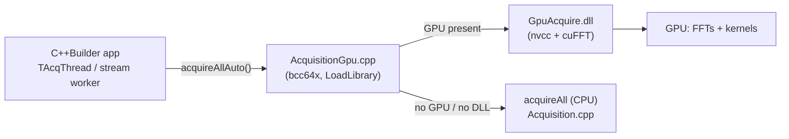

# GPU acquisition prototype

A drop-in GPU accelerator for the **acquisition** stage (the PRN 1..32 sky search), implemented with
**CUDA + cuFFT** and exposed through a small **C-ABI DLL** so it plugs into the C++Builder application
without pulling the CUDA toolchain into the RAD Studio build.

Acquisition is the receiver's best GPU candidate: one sky search runs ~1,400 length-38192 FFTs plus
~1,300 elementwise correlation passes, across two fully independent axes (32 PRNs × ~21 Doppler bins).
See the "GPU acceleration" analysis in [`../ARCHITECTURE.md`](../ARCHITECTURE.md) for why this stage was
chosen over tracking / nav-decode / PVT.

> **Status: prototype.** The code is written to compile and to mirror the CPU algorithm exactly, but it
> has not been built/run in this environment (no CUDA toolchain here). Treat the kernels as a reference
> design to build, validate with `GpuAcqConsole`, and tune. Known simplifications are listed under
> [Limitations & next steps](#limitations--next-steps).

---

## How it fits in



The application calls **`gps::acquireAllAuto(...)`**, which is signature-compatible with the existing
`gps::acquireAll(...)`. The shim loads `GpuAcquire.dll` lazily at runtime:

- DLL **present** and a GPU is usable → the search runs on the GPU.
- DLL **missing**, or no GPU/driver → it transparently falls back to the CPU `acquireAll`.

So the app links nothing CUDA-related and runs fine with or without the DLL.

---

## Files

| File | Toolchain | Role |
|------|-----------|------|
| `GpuAcquire.h` | shared | C-ABI surface: `GpuAcqConfig` / `GpuAcqResult` + 6 functions |
| `GpuAcquire.cu` | nvcc + cuFFT | the CUDA implementation (kernels + host orchestration) |
| `AcquisitionGpu.h/.cpp` | bcc64x | runtime-loading shim; `acquireAllGpu` + `acquireAllAuto` with CPU fallback |
| `build_gpu_dll.bat` | nvcc | builds `GpuAcquire.dll` |
| `GpuAcqConsole.cpp` | bcc64x | validates GPU vs CPU on a real capture and times both |
| `README.md` | — | this document |

---

## Prerequisites

- NVIDIA GPU + recent driver.
- **CUDA Toolkit** (provides `nvcc` and **cuFFT**), on `PATH`.
- **MSVC** build tools — `nvcc` uses `cl.exe` as its host compiler on Windows. Easiest: run the build from
  a *"x64 Native Tools Command Prompt for VS"*.

Not NVIDIA? The C-ABI boundary is the whole point — reimplement `GpuAcquire.*` against
**OpenCL + clFFT** or **Vulkan/OpenCL + [vkFFT](https://github.com/DTolm/VkFFT)** (vkFFT is especially good
for the non-power-of-two length 38192 = 16·7·11·31) and the app/shim are unchanged. cuFFT handles 38192
internally via mixed-radix + Bluestein, so no hand-written Bluestein is needed on any of these backends.

---

## Selecting the NVIDIA GPU on a hybrid (Optimus) laptop

Laptops usually expose two GPUs — an Intel/AMD **integrated** GPU and an NVIDIA **discrete** GPU. This path
always uses the **NVIDIA** GPU, by construction:

- **CUDA only enumerates NVIDIA GPUs.** `cudaGetDeviceCount` / `cudaGetDeviceProperties` never list the
  Intel/AMD integrated GPU, so our compute physically cannot land on it.
- **The DLL picks the best NVIDIA device explicitly.** `pickBestDevice` prefers a *discrete* device
  (`integrated == 0`), then the highest compute capability, then the most SMs/memory, and calls
  `cudaSetDevice` before any allocation or kernel — so even a (rare) twin-NVIDIA machine gets the strongest
  GPU. `runImpl` re-binds the device each call in case it runs on a different worker thread.
- **It reports the choice so you can verify it.** `gpuAcqDeviceName()` returns e.g.
  `NVIDIA GeForce RTX 4070 Laptop GPU`; `GpuAcqConsole` prints it as `Selected GPU : …`, and the GUI can
  show it in the status log.
- **Belt-and-suspenders Optimus hint.** The DLL also exports `NvOptimusEnablement` /
  `AmdPowerXpressRequestHighPerformance`, which ask the driver to prefer the discrete GPU. That flag mainly
  governs OpenGL/display routing and is most effective when exported from the **main .exe**; if you wire the
  GPU path into the app, add the same two lines to `GPSRx.cpp`:
  ```cpp
  extern "C" {
      __declspec(dllexport) unsigned long NvOptimusEnablement = 0x00000001;
      __declspec(dllexport) int           AmdPowerXpressRequestHighPerformance = 1;
  }
  ```
  (It does not change where CUDA kernels run — device selection already pins those to NVIDIA.)

**Verify it's the NVIDIA GPU:** run `GpuAcqConsole` and read the `Selected GPU` line, and/or watch
`nvidia-smi` while it runs (the process appears on the NVIDIA GPU). You can also force it in
*Windows Settings ▸ Display ▸ Graphics* (set `GPSRx.exe` / `GpuAcqConsole.exe` to **High performance**) or
in the *NVIDIA Control Panel ▸ Manage 3D Settings*.

---

## Build

**The DLL** (from a VS x64 native tools prompt, with CUDA on PATH):

```bat
cd gpu
build_gpu_dll.bat
```

Edit `-arch=sm_75` in the script to match your GPU (Turing `sm_75`, Ampere `sm_86`, Ada `sm_89`, …).
Then copy `GpuAcquire.dll` next to `GPSRx.exe`, together with the matching `cudart64_*.dll` and
`cufft64_*.dll` from the CUDA Toolkit `bin` folder.

**The validation console** (no CUDA needed — the DLL is loaded at runtime):

```bat
cd gpu
bcc64x -O2 -std=c++17 GpuAcqConsole.cpp AcquisitionGpu.cpp ^
       ..\Acquisition.cpp ..\CACode.cpp ..\Fft.cpp -o GpuAcqConsole.exe
```

---

## Validate

Run the console from a folder that has both the capture and `GpuAcquire.dll`:

```bat
GpuAcqConsole GPSdata-DiscreteComponents-fs38_192-if9_55.bin 2 500 2.5
```

It runs the CPU reference and the GPU path on the same samples, prints them side by side, reports the
**speed-up**, and checks that the **found set** and **code phase** agree (peak ratios should match within a
few percent — the small difference is FP32-vs-FP64 FFT rounding). A clean run ends with
`VERDICT: GPU matches CPU`.

---

## Integrate into the app

Minimal, low-risk wiring (the fallback means it's safe even without the DLL):

1. Add `gpu\AcquisitionGpu.cpp` to the `GPSRx.cbproj` project.
2. In `MainUnit.cpp`, `#include "gpu/AcquisitionGpu.h"`.
3. Replace the acquisition calls
   - in `TAcqThread::Execute` (the Acquire button), and
   - in `TStreamThread::runPass` (the streaming re-acquire),

   changing `gps::acquireAll(...)` → `gps::acquireAllAuto(...)`. The progress callback still fires per PRN.
4. Ship `GpuAcquire.dll` (+ CUDA runtime DLLs) next to the executable.

That's it — no other code changes, and the build still works on machines without a GPU.

---

## How it mirrors the CPU algorithm

`GpuAcquire.cu` is a 1:1 port of `acquirePrnImpl` / `acquireAll` in [`../Acquisition.cpp`](../Acquisition.cpp):

| CPU step | GPU step |
|----------|----------|
| `makeBlocks` (subtract DC mean) | host mean, subtracted inside `kBaseband` |
| `makeCarriers` (per Doppler bin) | `d_carr`, precomputed once in `buildCtx` |
| `makeBasebandSpectra` (carrier×block, forward FFT) | `kBaseband` + one **batched forward FFT** over nBins·numMs transforms (once, reused for all PRNs) |
| `conj(FFT(code))` per PRN | `d_code`, all 32 precomputed once in `buildCtx` |
| `prod = B · Cconj` | `kMul` |
| inverse FFT → `corr` | batched **inverse FFT** (cuFFT) |
| `acc += |corr|²` over ms | `kAccum` |
| argmax + second-peak/guard ratio | host peak pick (the accumulator is only ~3 MB/PRN) |

Two equivalence notes baked into the code:

- **Unscaled inverse FFT.** cuFFT's inverse has no `1/N`, while the CPU divides by N. Every GPU correlation
  is therefore `N×` the CPU value and the accumulator is `N²×` — but the peak/second-peak **ratio** and the
  **argmax** are scale-invariant, so `found` / `doppler` / `codePhase` come out identical. We skip the
  scaling on purpose (one fewer kernel).
- **Single precision.** Buffers are `cufftComplex` (FP32). The detection metric is a ratio of peaks over
  int8 data, so FP32 is more than enough; switch to `cufftDoubleComplex` / `Z2Z` if you want to bit-match
  the double-precision CPU during validation.

---

## Performance expectations

Acquisition is currently seconds on the CPU (longer in a Debug build). On a mid-range discrete GPU the
heavy work — batched 38192-point FFTs and elementwise correlation — typically drops to the **millisecond**
range, so expect a large speed-up dominated by FFT throughput and PCIe/setup overhead. The input transfer
is negligible here (acquisition only uses the first ~2 ms, ~76 KB). Measure on your hardware with
`GpuAcqConsole`.

---

## Limitations & next steps

This prototype favors clarity and verifiability over peak throughput. Natural follow-ups:

1. **Cache the context for streaming.** `acquireAllGpu` currently creates/destroys a context per call
   (re-uploading carriers + re-FFTing the 32 codes each time, ~a few ms). For the continuous "Stream from
   DAC" mode, hold one `gpuAcqCreate` context open across passes and just call `gpuAcqRun` each pass.
2. **Move the peak pick onto the GPU.** A per-bin max-reduction kernel keeps the whole pipeline resident
   and removes the per-PRN 3 MB device→host copy. (Kept on the host here so results are trivially
   comparable to the CPU.)
3. **Batch across PRNs.** All 32 inverse FFTs could be issued as one large batched transform to cut kernel
   launches, at the cost of ~10× more device memory for the products.
4. **Overlap with CUDA streams + pinned host memory** to hide the copies behind compute.
5. **Use the saved Doppler peak to seed `refineDoppler`** on the GPU as well — it's the same correlation
   structure over a finer frequency grid.
6. **FP64 / `Z2Z`** option for bit-exact validation against the CPU.
7. **Non-NVIDIA backend** (OpenCL + clFFT, or vkFFT) behind the same `GpuAcquire.h` ABI.
